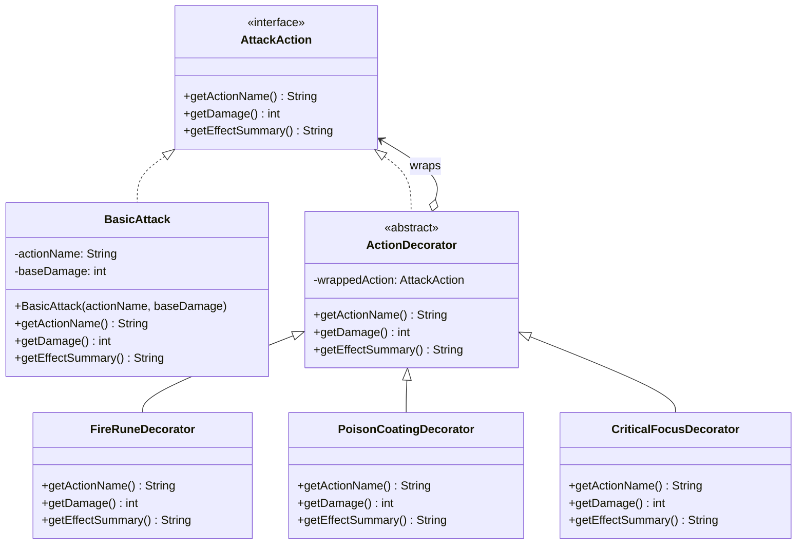

# Decorator UML

```mermaid
classDiagram
    class AttackAction {
        <<interface>>
        +getActionName() String
        +getDamage() int
        +getEffectSummary() String
    }

    class BasicAttack {
        -actionName: String
        -baseDamage: int
        +BasicAttack(actionName, baseDamage)
        +getActionName() String
        +getDamage() int
        +getEffectSummary() String
    }

    class ActionDecorator {
        <<abstract>>
        -wrappedAction: AttackAction
        +getActionName() String
        +getDamage() int
        +getEffectSummary() String
    }

    class FireRuneDecorator {
        +getActionName() String
        +getDamage() int
        +getEffectSummary() String
    }

    class PoisonCoatingDecorator {
        +getActionName() String
        +getDamage() int
        +getEffectSummary() String
    }

    class CriticalFocusDecorator {
        +getActionName() String
        +getDamage() int
        +getEffectSummary() String
    }

    AttackAction <|.. BasicAttack
    AttackAction <|.. ActionDecorator
    ActionDecorator o--> AttackAction : wraps
    ActionDecorator <|-- FireRuneDecorator
    ActionDecorator <|-- PoisonCoatingDecorator
    ActionDecorator <|-- CriticalFocusDecorator
```

This diagram shows the standard Decorator structure: every decorator is still an `AttackAction`, but it also wraps another `AttackAction`, allowing runtime stacking in any order.
