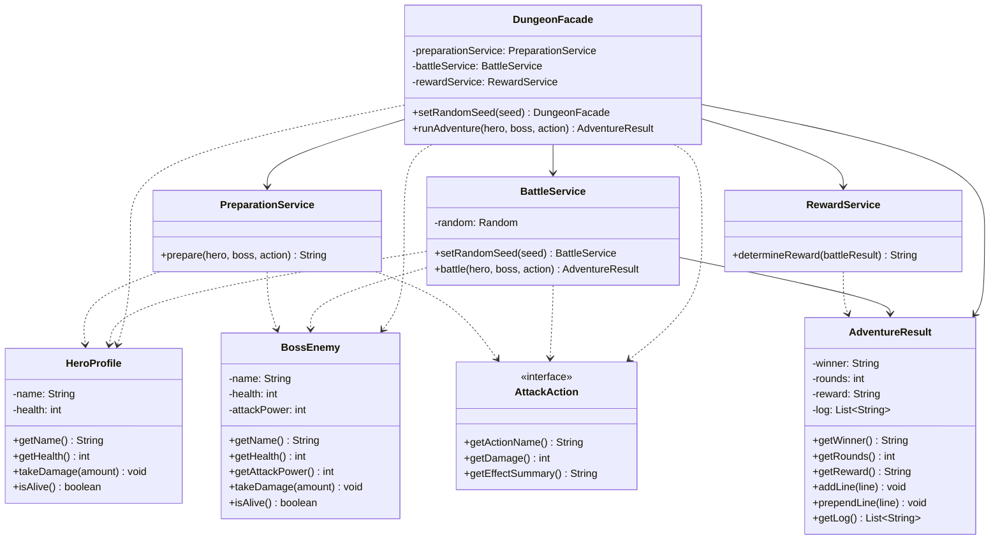

# Facade UML

```mermaid
classDiagram
    class DungeonFacade {
        -preparationService: PreparationService
        -battleService: BattleService
        -rewardService: RewardService
        +setRandomSeed(seed) DungeonFacade
        +runAdventure(hero, boss, action) AdventureResult
    }

    class PreparationService {
        +prepare(hero, boss, action) String
    }

    class BattleService {
        -random: Random
        +setRandomSeed(seed) BattleService
        +battle(hero, boss, action) AdventureResult
    }

    class RewardService {
        +determineReward(battleResult) String
    }

    class AdventureResult {
        -winner: String
        -rounds: int
        -reward: String
        -log: List~String~
        +getWinner() String
        +getRounds() int
        +getReward() String
        +addLine(line) void
        +prependLine(line) void
        +getLog() List~String~
    }

    class HeroProfile {
        -name: String
        -health: int
        +getName() String
        +getHealth() int
        +takeDamage(amount) void
        +isAlive() boolean
    }

    class BossEnemy {
        -name: String
        -health: int
        -attackPower: int
        +getName() String
        +getHealth() int
        +getAttackPower() int
        +takeDamage(amount) void
        +isAlive() boolean
    }

    class AttackAction {
        <<interface>>
        +getActionName() String
        +getDamage() int
        +getEffectSummary() String
    }

    DungeonFacade --> PreparationService
    DungeonFacade --> BattleService
    DungeonFacade --> RewardService
    DungeonFacade --> AdventureResult
    DungeonFacade ..> HeroProfile
    DungeonFacade ..> BossEnemy
    DungeonFacade ..> AttackAction
    BattleService ..> HeroProfile
    BattleService ..> BossEnemy
    BattleService ..> AttackAction
    BattleService --> AdventureResult
    RewardService ..> AdventureResult
    PreparationService ..> HeroProfile
    PreparationService ..> BossEnemy
    PreparationService ..> AttackAction
```

This diagram highlights the Facade split: `Main` needs only `DungeonFacade`, while preparation, combat, and reward decisions stay inside dedicated subsystem classes.
